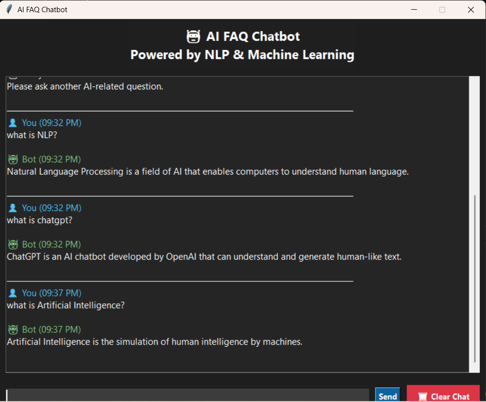

# 🤖 AI FAQ Chatbot

An AI-powered FAQ chatbot built using Python, NLP, and Machine Learning.

## 🚀 Features

- NLP-based question preprocessing
- TF-IDF Vectorization
- Cosine Similarity matching
- Dark UI using Tkinter
- Timestamp for every message
- User and Bot colored chat
- Typing indicator
- Clear Chat button
- Enter key support

## 🛠 Technologies Used

- Python
- Tkinter
- NLTK
- Scikit-learn
- JSON

## 📂 Project Structure

```
FAQ_chatbot/
│
├── chatbot.py
├── chatbot_gui.py
├── faqs.json
├── requirements.txt
├── README.md
└── screenshots/
```

## ▶️ Installation

Install required libraries:

```bash
pip install -r requirements.txt
```

Run the chatbot:

```bash
python chatbot_gui.py
```

## 📸 Screenshot



## 👩‍💻 Author

Nandani Rajawat